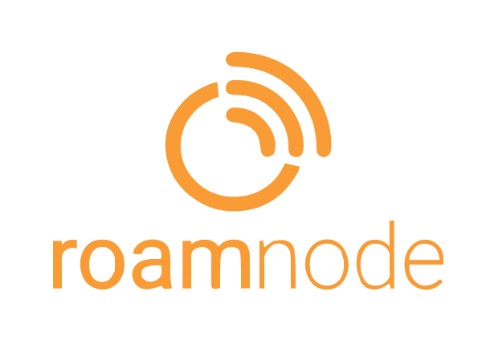

<div align="center">



# RoamNode

### Your vehicle. Your rules. Anywhere.

**The smart control platform built for life on the move — camper vans, RVs and anything that roams.**

[](#)
[](#)
[](#)


</div>

---

## What is RoamNode?

RoamNode is an end-to-end smart automation platform designed specifically for **mobile living environments** — camper vans and RVs Think of it as a smart home system that actually works when there's no home, no router, and no reliable signal.

You install a **Central Hub** in your vehicle. You plug in **expansion modules** for the things you want to monitor and control. You open the **mobile app**. That's it. From that point, your vehicle is self-aware.

Temperature creeping above 30°C? Ventilation fan turns on automatically. Sun sets at a specific location? Lights come on at the right brightness. Battery drops below a threshold? A relay cuts non-essential loads. All of this works whether you're connected to the internet or parked in the middle of nowhere.

---

## The Problem We're Solving

Nomadic living is booming. Millions of people live in, work from, or adventure in vehicles and boats. But the tools available to them are a patchwork of disconnected gadgets: a separate temperature monitor here, a manual switch panel there, a basic solar controller that doesn't talk to anything else.

**The result:** complexity, frustration, and a lot of manual intervention for things that should just handle themselves.

RoamNode replaces that patchwork with a single, integrated, programmable platform — one that's built for the realities of mobile life: intermittent connectivity, power constraints, harsh environments, and the need to trust your systems when you're far from help.

---

## How It Works

```
┌─────────────────────────────────────────────┐
│              Mobile App (iOS/Android)        │
│         Monitor · Automate · Control         │
└────────────────┬────────────────────────────┘
                 │ 
                 │ 
┌────────────────▼────────────────────────────┐
│                Central Hub                   │
│          Smart Gateway    
└──────┬──────────────────────────────────────┘
       │  
  ┌────▼──────────────────────┐
  │     Expansion Modules     │
  │  sensors · control · more │
  └───────────────────────────┘
```

The **Central Hub** is your vehicle's brain — it manages local communication with your phone and expansion modules, and cloud connectivity for remote monitoring and control.

**Expansion Modules** connect wirelessly to the Central Hub and cover the hardware capabilities your build needs. The lineup is growing — modules exist today for environmental sensing, load control, power monitoring, and lighting. New modules can be added without touching the Hub.

Everything works offline. When you're connected to the cloud you can check in remotely from anywhere.

---

### OTA Updates, Everywhere
Update firmware from the mobile app, or remotely from anywhere in the world. The Central Hub can even push updates to all connected expansion modules. Dual-bank partitioning with automatic rollback means a failed update never bricks a device.

### Modular by Design
Expansion modules connect wirelessly and pair with the Central Hub in minutes. Add what you need, when you need it. Each module auto-discovers and integrates without reconfiguring anything else.

---

## For Investors

The global RV and campervan market is growing at 7%+ annually — and the broader mobile living movement is expanding well beyond that. What's missing isn't hardware — there are plenty of gadgets. What's missing is **integration**: a platform that connects everything, runs automation logic, works without internet, and is secure enough to trust in a safety-critical environment.

<div align="center">

**Built for the road. Built to last.**

[Contact](mailto:office@roamnode.com)

</div>
